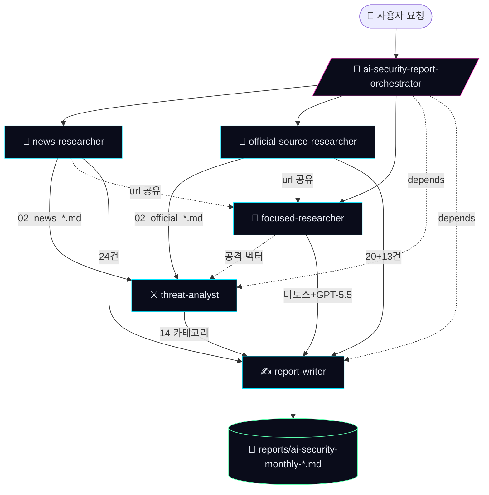

# AI 보안 위협 월간 보고서 하네스

> Claude Code 에이전트 5명이 협업해 한국어 AI 보안 월간 보고서를 자동 생성하는 **멀티 에이전트 하네스**(Multi-Agent Harness).


---

## 📌 개요

본 프로젝트는 **"AI 보안 위협 월간 보고서"**라는 단일 도메인 과제를 위해 설계된 Claude Code 기반 하네스다.
사용자가 "이번 달 AI 보안 보고서 만들어줘" 한 줄을 입력하면, 오케스트레이터 스킬이 5명의 전문 에이전트 팀을 자동 구성·조율해
**뉴스 → 공식 자료 → 위협 분석 → 심층 조사 → 통합 작성** 5단계를 병렬·순차로 실행하고
`reports/ai-security-monthly-{YYYY-MM-DD}.md` 한 편을 만들어낸다.

| 산출물 | 경로 | 설명 |
|--------|------|------|
| 통합 보고서 | [`reports/ai-security-monthly-2026-05-20.md`](./reports/ai-security-monthly-2026-05-20.md) | 본문 24,139자 · URL 인용 145건 · 9개 섹션 |
| 보고서 PDF | [`AI 보안 위협 월간 보고서.pdf`](./AI%20보안%20위협%20월간%20보고서.pdf) | 인쇄·배포용 PDF |
| 인터랙티브 웹 | [`index.html`](./index.html) | 캔버스 신경망 배경 · 글리치 타이포 · P1~P3 필터 매트릭스 · 모델 대결 비교 |

---

## 🏗 하네스 아키텍처



핵심 설계 원칙은 **분업 + 검증 + 통신**이다. 5명의 에이전트는 각자의 영역(뉴스/공식 자료/위협 분석/심층/통합)을 갖되,
서로 발견을 `SendMessage`로 공유하고, `TaskCreate`/`TaskUpdate`로 의존성을 명시한다. 각 에이전트는 자신의 **스킬**을 절차 가이드로 활용한다.

---

## 🤖 에이전트 5명

각 에이전트는 `.claude/agents/{name}.md`에 역할·입출력·통신 프로토콜·에러 핸들링이 정의되어 있다.

| 에이전트 | 역할 | 핵심 원칙 | 출력 |
|---------|------|----------|------|
| 📰 **news-researcher** | 최근 1개월 미디어 보도 수집 | 한국 매체 최소 3건 의무 · 사건당 5줄 사실 + 인용 가능 문구 | `_workspace/02_news_researcher_news.md` |
| 📜 **official-source-researcher** | NIST·OWASP·MITRE·KISA 등 1차 공식 자료 | 블로그 요약 인용 금지 · 한국어 자료 의도적 검색 | `_workspace/02_official_source_researcher_sources.md` |
| ⚔️ **threat-analyst** | OWASP LLM Top 10 + MITRE ATLAS 기반 위협 분석 | 메커니즘 다이어그램 · CVE/CVSS · 한국 맥락 최소 1건 · 책임있는 공개 | `_workspace/02_threat_analyst_threats.md` |
| 🔬 **focused-researcher** | 사용자 지정 키워드 심층 검증 (예: 미토스, GPT-5.5) | **존재 여부부터 검증** · 추측·창작 금지 · 미확인은 미확인 라벨 | `_workspace/02_focused_researcher_focus.md` |
| ✍️ **report-writer** | 통합·검증·작성 | 입력 외 사실 추가 금지 · 모든 진술에 [출처](URL) · 셀프 체크 | `reports/ai-security-monthly-{기준일}.md` |

---

## 🧰 스킬 6종

스킬은 에이전트가 따라야 할 **절차 가이드**다. 에이전트 정의가 "누가/언제"라면, 스킬은 "어떻게"다. `.claude/skills/{name}/SKILL.md`.

| 스킬 | 사용자 | 핵심 가이드 |
|------|--------|------------|
| **ai-security-report-orchestrator** | (메타) 오케스트레이터 | 5명 팀 생성 → 작업 등록 → 의존성 설정 → 병렬 실행 → 통합 → 정리. Phase 0~5 워크플로우. |
| **news-collection** | news-researcher | 한국·영문 매체 카탈로그 · 카테고리 키워드 매트릭스 · 신뢰도 라벨링 규칙 |
| **official-source-collection** | official-source-researcher | NIST/OWASP/MITRE/EU AI Act/KISA 권위 출처 카탈로그 + 검증 체크리스트 |
| **threat-analysis** | threat-analyst | OWASP LLM Top 10 / MITRE ATLAS / NIST AI RMF 기준 분류, 공격 메커니즘 템플릿 |
| **focused-research** | focused-researcher | WebSearch + WebFetch 1차 출처 확보, 동음이의 후보 식별, 미확인 라벨링 |
| **report-writing** | report-writer | 임원 요약·동향·사건·위협·특별 주제·권고·부록 구조 템플릿, 인용 규칙 |

---

## 🔄 워크플로우 (Phase 0~5)

오케스트레이터 스킬이 5단계로 팀을 운영한다.

### Phase 0 · 컨텍스트 확인
`_workspace/` 존재 여부로 **초기 실행 · 부분 재실행 · 새 실행** 모드를 판단한다.
부분 재실행("위협 분석 다시 써줘")은 해당 에이전트만 재호출하고 다른 산출물은 보존한다.

### Phase 1 · 준비
사용자 입력에서 조사 기간(기본: 직전 1개월), 특별 주제, 강조 카테고리를 추출하고
`_workspace/00_input/brief.md`에 작업 브리프를 작성한다.

### Phase 2 · 팀 구성
`TeamCreate`로 5명 팀을 만들고 `TaskCreate`로 5개 작업을 등록한다. 의존성:
- `위협 분석` ← `뉴스 수집` + `공식 자료 수집`
- `보고서 통합` ← 위 4개 모두

### Phase 3 · 병렬 조사
3명(news / official / focused)이 즉시 병렬 실행되고, threat-analyst는 의존성 해제 후 시작한다.
팀원 간 발견 공유는 `SendMessage`로:
- news → focused: 미토스·GPT-5.5 관련 보도 발견 시
- official → focused: System Card·정책 자료 발견 시
- news/official → threat: CVE/공격 기법 발견 시
- focused → threat: GPT-5.5 신규 공격 벡터 발견 시

### Phase 4 · 통합 보고
report-writer가 4개 산출물을 모두 읽고 한국어 보고서를 작성한다.
**셀프 체크**: 인용 URL 샘플 검증, 입력 외 진술 검사, 한국 사례 포함, 우선순위 적정성.

### Phase 5 · 정리
`SendMessage(shutdown_request)`로 팀원 종료 → `TeamDelete`로 팀 정리 → `_workspace/`는 감사 추적용으로 보존.

---

## 📂 디렉토리 구조

```
naver-connect-day/
├── .claude/
│   ├── agents/                          # 5개 에이전트 정의 (역할·프로토콜)
│   │   ├── news-researcher.md
│   │   ├── official-source-researcher.md
│   │   ├── threat-analyst.md
│   │   ├── focused-researcher.md
│   │   └── report-writer.md
│   └── skills/                          # 6종 스킬 (절차 가이드)
│       ├── ai-security-report-orchestrator/SKILL.md
│       ├── news-collection/SKILL.md
│       ├── official-source-collection/SKILL.md
│       ├── threat-analysis/SKILL.md
│       ├── focused-research/SKILL.md
│       └── report-writing/SKILL.md
├── _workspace/                          # 작업 디렉토리 (감사 추적, gitignore)
│   ├── 00_input/brief.md                # 작업 브리프
│   ├── 02_news_researcher_news.md       # 뉴스 수집 (337줄)
│   ├── 02_official_source_researcher_sources.md   # 공식 자료 (348줄)
│   ├── 02_threat_analyst_threats.md     # 위협 분석 (475줄)
│   ├── 02_focused_researcher_focus.md   # 심층 조사 (241줄+)
│   └── 04_report_writer_draft.md        # 보고서 초안
├── reports/
│   └── ai-security-monthly-2026-05-20.md  # 최종 보고서
├── index.html                            # 인터랙티브 웹 시각화
├── AI 보안 위협 월간 보고서.pdf           # PDF 버전
├── CLAUDE.md                             # 프로젝트 지침
└── README.md
```

---

## 🚀 사용법

### 새 회차 보고서 생성
Claude Code 세션에서:
```
이번 달 AI 보안 보고서 작성
```
`CLAUDE.md`의 트리거 규칙에 따라 `ai-security-report-orchestrator` 스킬이 자동으로 호출된다.
약 15~20분 내에 5명 팀이 보고서를 완성한다.

### 부분 재실행
```
보고서 위협 분석 섹션 다시 써줘
이번 달 추가 사건 반영
한국 사례 더 찾아줘
GPT-5.5 부분 보완
```
오케스트레이터가 `_workspace/` 존재를 확인하고 해당 에이전트만 재호출한다.

### 새 회차 시작
```
새 기준일로 보고서 다시 만들어줘
```
기존 `_workspace/`를 타임스탬프 디렉토리로 이동하고 새로 시작한다.

---

## 📊 2026-05-20 회차 출력 통계

| 영역 | 결과 |
|------|------|
| 뉴스 수집 | 24건 (한국 11 / 영문 13) — 본문 검증 21건 |
| 공식 1차 출처 | 20건 + 보조 13건 (한국어 4건) |
| 위협 카테고리 | 19개 분석 → 보고서 반영 14개 |
| 권고 항목 | P1 5건 / P2 5건 / P3 3건 = 13건 |
| 최종 분량 | 24,139자 (마크업 포함 37,396자) |
| URL 인용 | 145건 (영문 41 + 한국 16 + 공식 18 + v2 추가 16 등) |
| 한국 사례 키워드 | 124회 본문 등장 |

### 핵심 발견
1. Mythos(2026-04-07) + GPT-5.5(2026-04-23) 두 프론티어 모델이 한 달 사이 사이버 **"High"** 등급 동시 진입
2. Mythos는 출범 당일 Discord 무단 접근 사건 — 통제 배포 전략의 핵심 가정이 즉시 무력화 (Bloomberg 4/21)
3. 한국은 **Glasswing 미참여 + OpenAI TAC 신청 가능**의 이중 구조 — 정책 권고 P1 핵심 이슈
4. MSRC Semantic Kernel **CVSS 10.0** — 공식 등재된 첫 prompt-to-shell 최고 등급 CVE
5. AI 인프라 익스플로잇 무기화 주기가 시간 단위로 단축 (LMDeploy 12h 31m, LiteLLM 36h → CISA KEV)
6. EU AI Act 강제 집행이 2026-08-02부터 시작 (보고서 발행 약 2.5개월 뒤)

---

## 🔧 하네스 확장 방법

새 도메인(예: "금융 위협 월간 보고서")을 위한 하네스를 만들려면:

1. `.claude/agents/` 에 도메인 전문 에이전트 정의
2. `.claude/skills/` 에 각 에이전트의 절차 가이드 작성
3. `.claude/skills/{domain}-orchestrator/SKILL.md` 에 5단계 워크플로우 정의
4. `CLAUDE.md` 의 트리거 규칙 추가

본 프로젝트는 **하네스 설계 패턴의 레퍼런스 구현**으로 활용 가능하다.

---

## 📜 변경 이력

| 날짜 | 변경 | 비고 |
|------|------|------|
| 2026-05-20 | 초기 구성 (에이전트 5명 + 스킬 6종 + 오케스트레이터) | 첫 회차 보고서 발행 |
| 2026-05-20 | 인터랙티브 웹페이지 + PDF 출력 추가 | GitHub 공개 |

---

## 📄 라이선스 / 메타

- **언어**: 한국어 (보고서·웹·문서 일관)
- **모델**: Claude Opus / Sonnet 혼용 (오케스트레이터 + 5명 에이전트)
- **작성**: 5-agent team via Claude Code
- **저장소**: [revfactory/ai-security](https://github.com/revfactory/ai-security)
